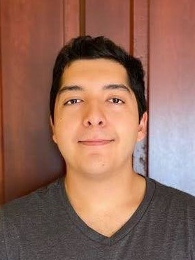

# About Me

## Adrian Perez

 

*image of my face...*

## Introduction

I am a Software Engineer with about 3+ years of experience, specializing in backend (server-side) development using technologies like Java Spring, REST APIs, Kafka, Docker, Kubernetes, and more. I like to learn and gain new skills that can help me improve my work. I also like to get involved with client-side development, as it allows me to see the whole process of how a website works and fetches data for the user.

### List of Technologies I Know 
Programming Languages:
- Java
- Python
- JavaScript/TypeScript
- Bash
- PowerShell
- SQL
- ...
  
Other Languages:
- HTML
- CSS
- XML
- Markdown
- ...

### Other Skills
- Spring Framework
- Angular
- Docker / Docker-Compose
- Kubernetes
- Apache Kafka
- Azure
- Linux
- AWS
- Node
- Git
- Junit
- JSON
- ...

## Background

Hello, and welcome to my website! As you saw at the top, my name is Adrian, and I graduated in May 2022 from Lewis University. I attended school full-time for four years, during that time I spent most of my time learning something new, homework, or working on weekends. I majored in Computer Science with a concentration in Software Engineering with a minor in Mathematics. While at college I found a interest in Cyber Security and Data Science and try to continue it as a hobby.

### What I Hope to Learn

*   Learn Backend technologies  
*   Learn more about the frontend
*   Full Stack
*   Familiarize myself with common development technology's

### My Favorite Hobbies

When I have free time, one of my favorite hobbies is watching TV or browsing videos, like on YouTube. There's something about it that I find relaxing. This hobby is quite simple compared to some of my others — all I have to do is lay on the couch and turn on the TV. However, it can get old pretty quickly if there’s nothing interesting to watch.

Some of my other hobbies include playing video games with friend, scrolling through social media (mainly looking at memes), practicing the trumpet, and tinkering with computers. These are just a few of my current hobbies that I enjoy when I find myself with some free time.

# Fun Fact!

A fun fact about me is that if I were to choose a superpower it would be super speed

